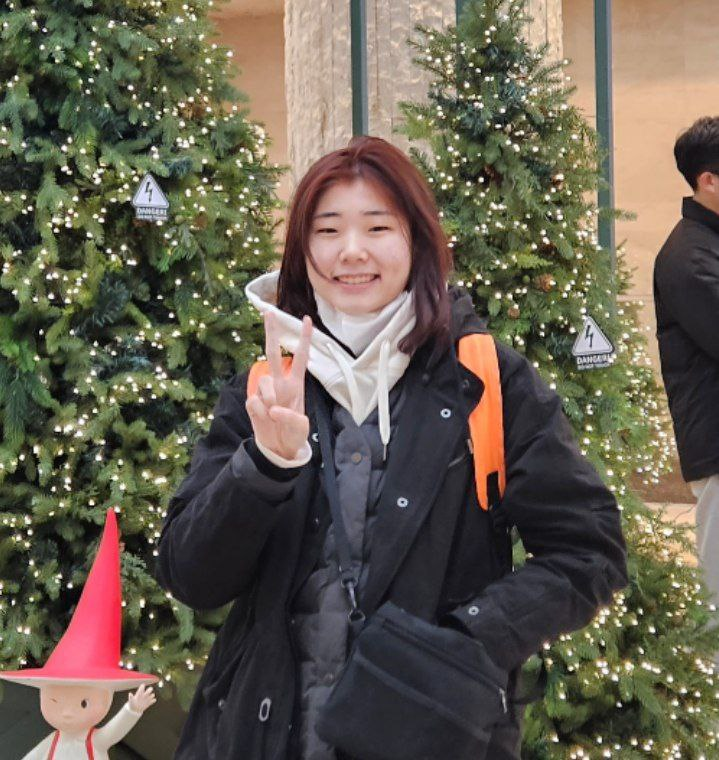
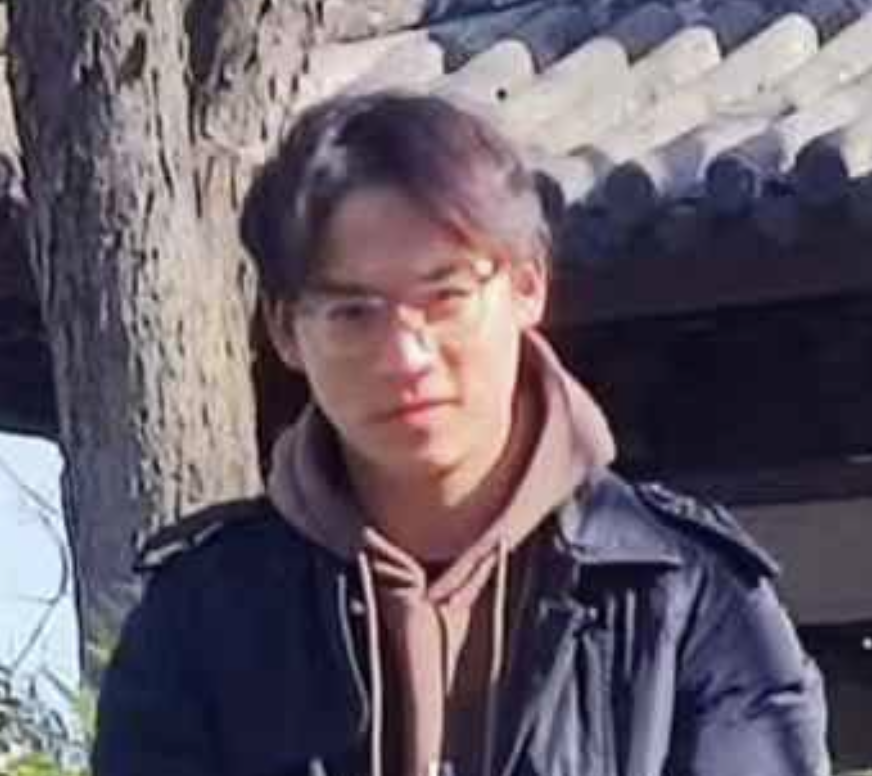
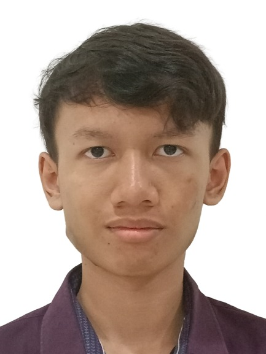

# About Us

We are a team based in the [School of Computing, National University of Singapore](http://www.comp.nus.edu.sg).

You can reach us at the email `seer[at]comp.nus.edu.sg`

## Project team

### Judy Park (Seoyoung)

[[github](https://github.com/judy1x4)]

* Role: Testing

### Waylon

[[github](http://github.com/waylonggggg)]

* Role: Code Quality
* Responsibilities: UI

### Cai Zhenze

[[Nova1729](http://github.com/Nova1729)]

* Role: Deliverables and deadlines  
* Responsibilities: Ensure that we submit our assignments before the deadline

### Gabriel Mario Antaputra

[[github](http://github.com/thegrimbee)]

* Role: Documentation
* Responsibilities: Quality of documents
