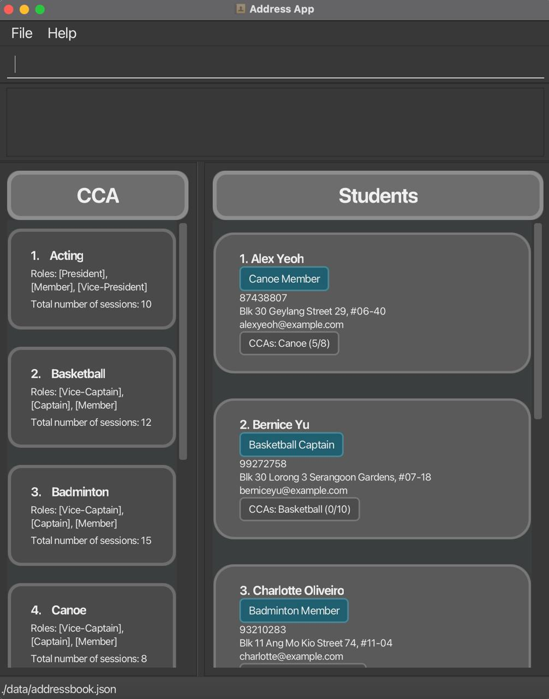
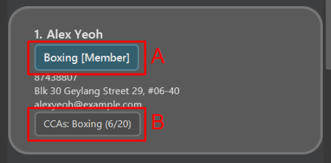
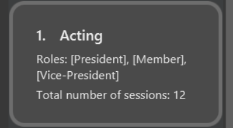
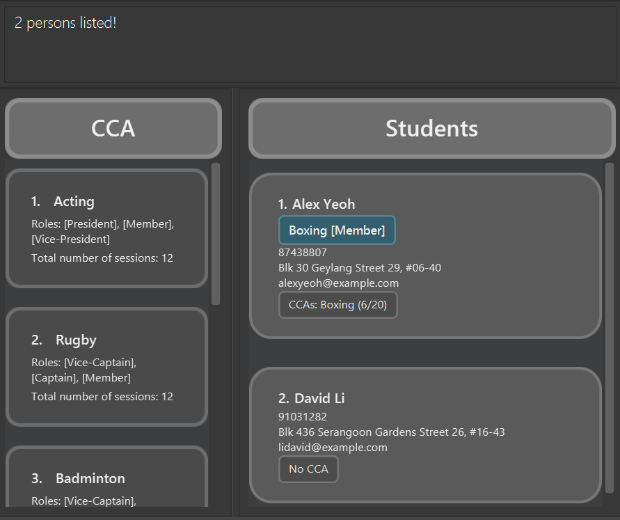

# CCAttendance User Guide

Welcome to CCAttendance! We've created this friendly desktop app for **recording and tracking attendance of students in CCAs**. It’s built specially for hall attendance managers who want a simpler, faster way to track who’s showing up for which CCAs. If the current system feels messy and tiring to use, CCAttendance is here to make your life easier! CCAttendance is your helpful assistant that makes it easy to organise students and coordinating hall activities all in one place.

<!-- * Table of Contents -->
<page-nav-print />

--------------------------------------------------------------------------------------------------------------------

## Quick start

1. Ensure you have Java `17` or above installed in your Computer. 
   **Mac users:** Ensure you have the precise JDK version prescribed [here](https://se-education.org/guides/tutorials/javaInstallationMac.html).

1. Download the latest `.jar` file from [here](https://github.com/AY2425S2-CS2103T-T09-4/tp/releases/tag/v1.3).

1. Copy the file to the folder you want to use as the _home folder_ for CCAttendance.

1. Open a command terminal, `cd` into the folder you put the jar file in, and use the `java -jar CCAttendance.jar` command to run the application. 
   A GUI similar to the below should appear in a few seconds. Note how the app contains some sample data. 
   

1. Type the command in the command box and press Enter to execute it. e.g. typing **`help`** and pressing Enter will open the help window. 
   Some example commands you can try:

   * `list` : Lists all students.

   * `create_s n/John Doe p/98765432 e/johnd@example.com a/John street, block 123, #01-01` : Adds a contact named `John Doe` to the list.

   * `delete_s 3` : Deletes the 3rd student shown in the current list.

   * `clear` : Deletes all contacts.

   * `exit` : Exits the app.

1. Refer to the [Features](#features) below for details of each command.

## Important Details

### Student

* Each student is represented by a student card. Other than the name, phone number, address, and email, the student card also shows their attendance and role in each CCA.

* The role is represented by the element labeled `A` which shows the CCA on the left and the role inside the square brackets. E.g. the student above is a `Member` of `Boxing` CCA.

* The attendance is represented by the element labeled `B` which shows the CCA on the left and the number of sessions attended out of the total sessions in the brackets. E.g. the student above has attended 6 out of 20 sessions in `Boxing` CCA.

### CCA

* Each CCA is represented by a CCA card. The card shows the name of the CCA, the roles available in the CCA, and the total sessions.

* The name of each role are the texts in the square brackets. E.g. the CCA above has 3 roles: `President`, `Vice-President`, and `Member`. `Member` is the default role and will thus appear in every CCA.

--------------------------------------------------------------------------------------------------------------------

## Features

<box type="info" seamless>

**Notes about the command format:** 

* Words in `UPPER_CASE` are the parameters to be supplied by the user. 
  e.g. in `create_s n/NAME`, `NAME` is a parameter which can be used as `create_s n/John Doe`.

* Items in square brackets are optional. 
  e.g `n/NAME [c/CCA_NAME]` can be used as `n/John Doe c/Basketball` or as `n/John Doe`.

* Items with ... after them can be used multiple times including zero times.
e.g. `[r/ROLE_NAME]...` can be used as `r/Captain r/Vice-Captain` or as `r/Captain` or as nothing at all.

* Parameters can be in any order. 
  e.g. if the command specifies `n/NAME p/PHONE_NUMBER`, `p/PHONE_NUMBER n/NAME` is also acceptable.

* Extraneous parameters for commands that do not take in parameters (such as `help`, `list`, `exit` and `clear`) will be ignored. 
  e.g. if the command specifies `help 123`, it will be interpreted as `help`.

* If you are using a PDF version of this document, be careful when copying and pasting commands that span multiple lines as space characters surrounding line-breaks may be omitted when copied over to the application.
</box>

### Viewing help : `help`

Shows a message explaning how to access the help page.

Format: `help`

### Listing all students : `list`

Shows a list of all students in the student list.

Format: `list`

### Locating students by name: `find`

Finds students whose names contain any of the given keywords.

Format: `find KEYWORD [MORE_KEYWORDS]`

* The search is case-insensitive. e.g `hans` will match `Hans`.
* The order of the keywords does not matter. e.g. `Hans Bo` will match `Bo Hans`.
* Only the name is searched.
* Only full words will be matched e.g. `Han` will not match `Hans`.
* Persons matching at least one keyword will be returned (i.e. `OR` search).
  e.g. `Hans Bo` will return `Hans Gruber`, `Bo Yang`.

Examples:
* `find John` returns `john` and `John Doe`
* `find alex david` returns `Alex Yeoh`, `David Li` 

### Creating a student: `create_s`

Creates and adds a student to the list of students.

Format: `create_s n/NAME p/PHONE_NUMBER e/EMAIL a/ADDRESS​`

* Names should only contain alphabetic characters and a single space between words, and it should not be blank. Unfortunately, we do not allow `/` in names, making names like `David s/o Daniel` invalid.

Examples:
* `create_s n/John Doe p/98765432 e/johnd@example.com a/John street, block 123, #01-01` creates a student named `John Doe`, with phone number `98765432`, email of `johnd@example.com`, and address of `John street, block 123, #01-01`.

### Creating a CCA: `create_c`

Creates and adds a CCA to the list of CCAs.

Format: `create_c c/CCA_NAME`
* Creates and adds a CCA with a name.
* The new CCA will have a default role `Member` and total sessions set to 0 by default.
* Cca names must consist of alphanumeric characters and can only include spaces or hyphens between words. For example, R0ck-n-R0ll is a valid CCA name, but -Basketball- is not. It is up to the user to make meaningful CCA names.
<box type="warning" seamless>

**Caution:**
CCA names are case-sensitive. For example, `Basketball` and `basketball` are considered different CCA names.
</box>

Examples:
* `create_c c/Basketball` creates a CCA named `Basketball`, with a role `Member` and a `total sessions` set to 0.

### Editing a student's basic details : `edit_s`

Edits the name, phone, email, or address of an existing student in the student list.

Format: `edit_s INDEX [n/NAME] [p/PHONE] [e/EMAIL] [a/ADDRESS]​`

* Edits the student at the specified `INDEX`. The index refers to the index number shown in the displayed student list. The index **must be a positive integer** (1, 2, 3, …).
* At least one of the optional fields (`n/`, `p/`, `e/`, `a/`) must be provided.
* Existing values for the specified fields will be overwritten by the new input values.

Examples:
* `edit_s 1 p/91234567 e/johndoe@example.com` Edits the phone number and email address of the student at index 1 to be `91234567` and `johndoe@example.com` respectively. Their name, address, CCAs, and roles remain unchanged.
* `edit_s 3 n/Peter Tan a/Blk 123, Clementi Ave 4, #05-06` Edits the name and address of the student at index 3. Their phone, email, CCAs, and roles remain unchanged.

### Editing a CCA : `edit_c`

Edits an existing CCA in the CCA list.

Format: `edit_c INDEX [c/CCA_NAME] [r/ROLE_NAME]... [t/TOTAL_SESSIONS]`

<box type="warning" seamless>

**Caution:**
Role names are case-sensitive. For example, `Captain` and `captain` are considered different.
</box>

* Edits the CCA at the specified `INDEX`. The index refers to the index number shown in the displayed CCA list. The index **must be a positive integer** (1, 2, 3, …).
* At least one of the optional fields must be provided.
* Existing values will be updated to the input values.
* The new name must not match any existing CCA names in the CCA list.
* The amount of total sessions must be a non-negative integer.
* Regardless of the input for the role field, a `Member` role will automatically be created.
* Typing `r/` without specifying any roles after it remove all the CCA’s roles except for `Member`.
* If an existing student have their role removed from the CCA, the student's role will be set to `Member`.
* If an existing student's attended sessions is above the new total sessions, the student's attended sessions will be set to the new total sessions.

Examples:
*  `edit_c 1 c/Volleyball r/Captain r/Vice-Captain t/40` Edits the CCA with the first index in the CCA list. Renames it to `Volleyball`, updates the available roles to `Captain`, `Vice-Captain` and `Member`, and updates the total sessions to 40.

### Adding a CCA to a student: `add_c`

Assigns an existing CCA from the CCA list to a specific student. The student will be assigned a default role (e.g., `Member`) for the added CCA.

Format: `add_c INDEX c/CCA_NAME`

* Assigns the CCA specified by `CCA_NAME` to the student at the specified `INDEX`.
* The index `INDEX` refers to the index number shown in the displayed student list. The index **must be a positive integer** (1, 2, 3, …).
* The `CCA_NAME` provided must exactly match the name of a CCA already present in the main CCA list (use `list` or view the CCA panel to see available CCAs).
* The student must **not** already be assigned to the specified CCA.

Examples:
* `add_c 2 c/Tennis` Assigns the existing `Tennis` CCA to the student at index 2 in the current student list. The student gets the default role for `Tennis`.

### Adding a role to a student in a CCA: `add_r`

Adds a role to a student in a CCA.

Format: `add_r INDEX c/CCA_NAME r/ROLE_NAME`
* Adds a role to the student at the specified `INDEX` in the CCA.
* The index refers to the index number shown in the displayed student list.
* The index **must be a positive integer** (1, 2, 3, …​).
* The role must exist in the CCA.
* The student must be in the CCA.
* The student must not have an existing role in the CCA (other than `Member`).

Examples:
* `add_r 2 c/Basketball r/Captain` Adds the role `Captain` to the 2nd student in the student list in the CCA `Basketball`.

### Recording attendance : `attend`
Records the attendance of a student in a CCA.

Format: `attend INDEX c/CCA_NAME a/AMOUNT`

* Records the attendance of the student at the specified `INDEX` in the specified CCA.
* The index refers to the index number shown in the displayed student list.
* The index **must be a positive integer** (1, 2, 3, …)​
* The amount of attendance **must be a positive integer**.
* The resulting total sessions attended by the student must not exceed the total sessions of the CCA.

Examples:
* `attend 2 c/Basketball a/1` Records the attendance of the 2nd student in the student list in the CCA `Basketball` one time (i.e. increase attendance by 1).
* `attend 3 c/Basketball a/2` Records the attendance of the 3rd student in the student list in the CCA `Basketball` two times (i.e. increase attendance by 2).

### Deleting a student : `delete_s`

Deletes the specified student from the list of students.

Format: `delete_s INDEX`

* Deletes the student at the specified `INDEX`.
* The index refers to the index number shown in the displayed student list.
* The index **must be a positive integer** (1, 2, 3, …).​

Examples:
* `list` followed by `delete_s 2` deletes the 2nd student in the student list.
* `find Betsy` followed by `delete_s 1` deletes the 1st student in the results of the `find` command.

### Deleting a CCA : `delete_c`

Deletes the specified CCA from the list of CCAs.

Format: `delete_c INDEX`

* Deletes the CCA at the specified `INDEX`.
* The index refers to the index number shown in the displayed CCA list.
* The index **must be a positive integer** (1, 2, 3, …).​
* Unlike student list, the CCA list will always show all CCAs.
* Deleting a CCA will also delete the CCA from each student that is in the CCA.

Examples:
* `delete_c 2` deletes the 2nd CCA in the CCA list.

### Removing a role from a student in a CCA : `remove_r`

Removes a role from a student in a CCA.

Format: `remove_r INDEX c/CCA_NAME`

* Removes the role from the student at the specified `INDEX` in the CCA (i.e. turns the student into a `Member`).
* The index refers to the index number shown in the displayed student list.
* The index **must be a positive integer** (1, 2, 3, …​).
* The student must be in the CCA.
* The student must have a role in the CCA.

Examples:
* `remove_r 2 c/Basketball` Removes the role of the 2nd student in the student list in the CCA `Basketball`.

### Removing a CCA from a student : `remove_c`

Removes a specific CCA assignment (including its associated role and attendance) from a student.

Format: `remove_c INDEX c/CCA_NAME`

* Removes the CCA specified by `CCA_NAME` from the student at the specified `INDEX`.
* The index `INDEX` refers to the index number shown in the displayed student list. The index **must be a positive integer** (1, 2, 3, …).
* The student must currently be assigned to the specified `CCA_NAME` for the removal to be successful.

Examples:
* `remove_c 1 c/Basketball` Removes the `Basketball` CCA assignment from the student at index 1 in the current student list.

### Clearing all entries : `clear`

Clears all entries in both student and CCA list.

Format: `clear`

### Exiting the program : `exit`

Exits the program.

Format: `exit`

### Saving the data

CCAttendance data are saved in the hard disk automatically after any command that changes the data. There is no need to save manually.

### Editing the data file

CCAttendance data are saved automatically as a JSON file `[JAR file location]/data/addressbook.json`. Advanced users are welcome to update data directly by editing that data file.

<box type="warning" seamless>

**Caution:**
If your changes to the data file makes its format invalid, CCAttendance will discard all data and start with an empty data file at the next run.  Hence, it is recommended to take a backup of the file before editing it. 
Furthermore, certain edits can cause CCAttendance to behave in unexpected ways (e.g., if a value entered is outside the acceptable range). Therefore, edit the data file only if you are confident that you can update it correctly.
</box>

--------------------------------------------------------------------------------------------------------------------

## FAQ

**Q**: How do I transfer my data to another Computer? 
**A**: Install the app in the other computer and overwrite the empty data file it creates with the file that contains the data of your previous CCAttendance home folder.

--------------------------------------------------------------------------------------------------------------------

## Known issues

1. **When using multiple screens**, if you move the application to a secondary screen, and later switch to using only the primary screen, the GUI will open off-screen. The remedy is to delete the `preferences.json` file created by the application before running the application again.
2. **If you minimize the Help Window** and then run the `help` command (or use the `Help` menu, or the keyboard shortcut `F1`) again, the original Help Window will remain minimized, and no new Help Window will appear. The remedy is to manually restore the minimized Help Window.

--------------------------------------------------------------------------------------------------------------------

## Command summary

Action     | Format, Examples
-----------|----------------------------------------------------------------------------------------------------------------------------------------------------------------------
**Help**   | `help`
**List**   | `list`
**Find**   | `find KEYWORD [MORE_KEYWORDS]`  e.g., `find James Jake`
**Create Student**    | `create_s n/NAME p/PHONE_NUMBER e/EMAIL a/ADDRESS​`   e.g., `create_s n/James Ho p/22224444 e/jamesho@example.com a/123, Clementi Rd, 1234665`
**Create CCA**    | `create_c c/CCA_NAME`   e.g., `create_c c/Basketball`
**Edit Student**   | `edit_s INDEX [n/NAME] [p/PHONE_NUMBER] [e/EMAIL] [a/ADDRESS]​`  e.g.,`edit_s 2 n/James Lee e/jameslee@example.com`
**Edit CCA**   | `edit_c INDEX [c/CCA_NAME] [r/ROLE_NAME]... [t/TOTAL_SESSIONS]`  e.g., `edit_c 2 c/Basketball r/Captain r/Vice-Captain t/40`
**Add CCA**    | `add_c INDEX c/CCA_NAME`   e.g., `add_c 2 c/Basketball`
**Add Role**    | `add_r INDEX c/CCA_NAME r/ROLE_NAME`   e.g., `add_r 2 c/Basketball r/Captain`
**Record Attendance**   | `attend INDEX c/CCA_NAME a/AMOUNT`  e.g., `attend 2 c/Basketball a/1`
**Delete Student** | `delete_s INDEX`  e.g., `delete_s 3`
**Delete CCA** | `delete_c INDEX`  e.g., `delete_c 2`
**Remove Role** | `remove_r INDEX c/CCA_NAME`  e.g., `remove_r 2 c/Basketball`
**Remove CCA** | `remove_c INDEX c/CCA_NAME`  e.g., `remove_c 2 c/Basketball`
**Clear**  | `clear`
**Exit**   | `exit`

